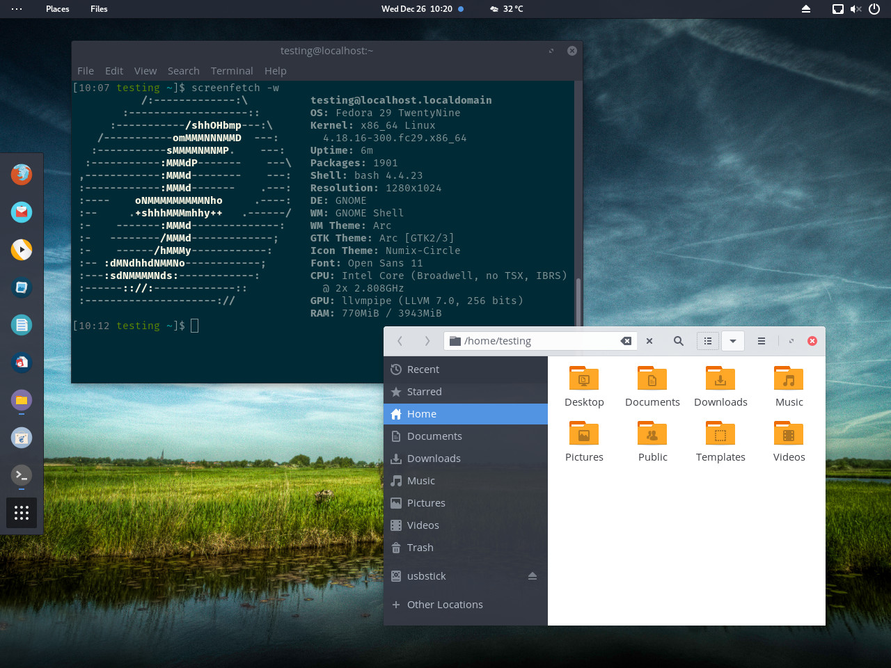

# Ansible Role: Korora

Manage, tweak and customise your Fedora Workstation with Ansible. This role
applies the Korora (my Fedora Remix) settings by default, but you can customise
these to your liking.



## Requirements

The target machine should be running a supported version of Fedora (28 onwards).

## Role Variables

Currently, this role only configures Fedora for the GNOME desktop. Over time
this role might support other desktops, but for now it expects stock install of
Fedora Workstation.

While you can override the default variables in this role, there are also some
matching `custom` variables which let you do your own thing without changing
the defaults.

* korora_copr_repos_custom
* korora_firewall_custom
* korora_packages_custom
* korora_services_custom

## Dependencies

None

## Example Playbook

You can run this playbook against localhost or remote machines.

The separate [Korora Ansible repo](https://github.com/csmart/korora-ansible)
has a sample inventory file and site playbook to call the role.

Here is an example `hosts.yml` inventory file in YAML format for localhost,
which also sets additional parameters to manage extra packages.

```yaml
all:
  hosts:
    localhost:
      ansible_connection: local
      korora_packages_custom:
        install:
          - mutt
        remove:
          - evolution
  vars:
    ansible_python_interpreter: /usr/bin/python3
```

Execute the play like so.

```bash
ansible-playbook --inventory ./inventory/hosts.yml korora.yml --ask-become-pass
```

## License

GPLv3

## Author Information

Chris Smart https://blog.christophersmart.com
